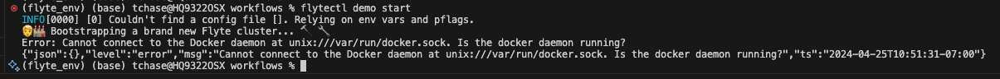
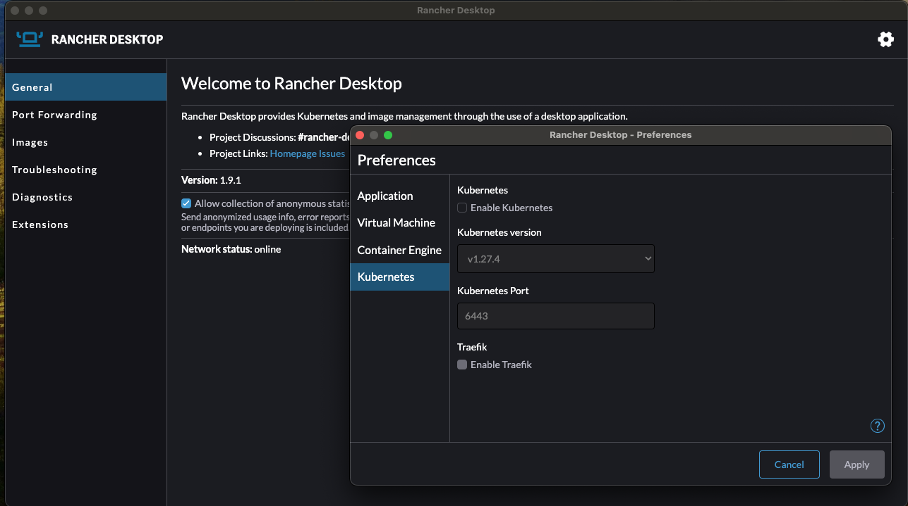

# Instructions

## create conda environment 

* conda create -n flyte_env python=3.9
* conda activate flyte_env
* conda install pandas
* conda install scikit-learn=1.2.2
* conda install matplotlib
* conda install mlflow
* pip install flytekit
* pip install flytekitplugins-mlflow
* pip install flytekitplugins-envd

## run hello world example 

* pyflyte run example.py hello_world_wf
* pyflyte run example.py hello_world_wf --name Ada

## flyte project

* create flyte-ready projects (from flyte github templates)
    * pyflyte init --template basic_template-dockerfile basic_template
    * pyflyte init --template wine-classification wine-classification
        * this was modified to create the repo in the reference repository

## basic_template example

* install requirements in conda environment
    * cd basic_template
    * pip install -r requirements.txt
* run workflow in a local python environment
    * cd workflows
    * pyflyte run example.py wf

## wine-classification example

* install requirments in conda environment
    * cd wine-classification
    * pip install -r requirements.txt
* run workflow in a local python environment
    * cd workflows
    * pyflyte run wine_classification_example.py training_workflow

## run on local cluster

* update x-code if necessary
* install flytectl
    * brew install flyteorg/homebrew-tap/flytectl
* export FLYTECTL_CONFIG environment variable in your shell
    *  export FLYTECTL_CONFIG=~/.flyte/config-sandbox.yaml
* start the docker daemon
    * open rancher desktop
* start the demo cluster
    * flytectl demo start
    * if you are running rancher desktop and you get an error about not finding docker daemon
        * sudo ln -s ~$USER/.rd/docker.sock /var/run/docker.sock

* if you get the error "Error starting userland proxy: listen tcp4 0.0.0.0:6443: bind: address already in use"
    * sudo lsof -i -P -n | grep <port number>  # List who's using the port
    * https://github.com/flyteorg/flyte/issues/3792
    * https://discuss.flyte.org/c/ask-the-community/52
    * go into rancher desktop and disable kubernetes (and maybe traefik as well)

* create a project on the demo cluster to correspond to your local Flyte project
    * flytectl config init
    * flytectl create project \\ \
    --id "my-project" \\ \
    --labels "my-label=my-project" \\ \
    --description "My Flyte project" \\ \
    --name "My project"
* Run the workflow on the Flyte cluster with pyflyte run using the --remote flag and additional parameters for the project name and domain. In this example, you can also optionally pass a name parameter to the workflow:
    * pyflyte run --remote -p my-project -d development example.py wf --name Ada
    * You should see a URL to the workflow execution on your demo Flyte cluster, where <execution_name> is a unique identifier for the workflow execution:

## inspecting the workflow run in the FlyteConsole web interface
* execution view
    * The default execution view shows the list of tasks executing in sequential order.

* task panel
    * Clicking on a single task will open a panel that shows task logs, inputs, outputs, and metadata.

* graph view
    * The Graph view shows the execution graph of the workflow, providing visual information about the topology of the graph and the state of each node as the workflow progresses.

* timeline view

## Hyperparameter tuning example with MLFlow Plugin

* clone the demo repository
    * https://github.com/tchase56/flyte_demo
* note: for this current version to work I had to switch from rancher desktop to docker desktop
* start the docker daemon
    * open docker desktop
* start the demo cluster
    * flytectl demo start
    * if you encounter an error look at the "run on local cluster" section above
* navigate to the folder containing wine_classification_hyperparameter_search.py
* run the "training_workflow()" workflow in wine_classification_hyperparameter_search.py
    * pyflyte run --remote wine_classification_hyperparameter_search.py training_workflow
    * this file uses ImageSpec for image creation
        * it uses a flyte docker container as a base image and installs libraries in it directly from in the code of the workflow
    * this file uses the mlflow_autolog
        * this decorator automatically logs parameters from the sklearn experiment

### UI

* nodes view

* graph view

### Flyte Deck (hyperparameter search task)
* mlflow metrics

* mlflow params

* input

* output

references
* cookiecutter python project
    * https://cookiecutter.readthedocs.io/en/1.7.2/first_steps.html
* flyte
    * https://docs.flyte.org/en/latest/introduction.html
    * mlflow
        * https://docs.flyte.org/en/latest/flytesnacks/examples/mlflow_plugin/index.html
        * https://docs.flyte.org/en/latest/flytesnacks/examples/mlflow_plugin/mlflow_example.html
    * https://flyte.org/integrations
* demo repo
    * https://github.com/tchase56/flyte_demo

## helpful commands

* conda remove -n flyte_env --all
* bash ./docker_build.sh
* flytectl demo start --image basic_template:f335aaa22bbaba4884a4c3d931a994c1a2f9ed9c
* pyflyte run wine_classification_example.py training_workflow 
* pyflyte run --remote -p my-project-wine-10 -d development wine_classification_example.py training_workflow

* flytectl demo teardown
* pip list --format=freeze > requirements.txt
* https://github.com/flyteorg/flytelab/blob/main/README.md
* docker image build -t test_image .
* flytectl demo start --image test_image

* envd context create --name flyte-sandbox --builder tcp --builder-address localhost:30000 --use
* 